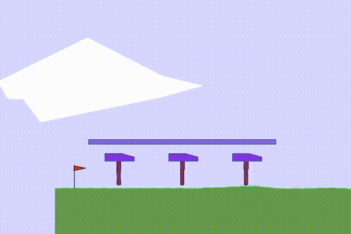
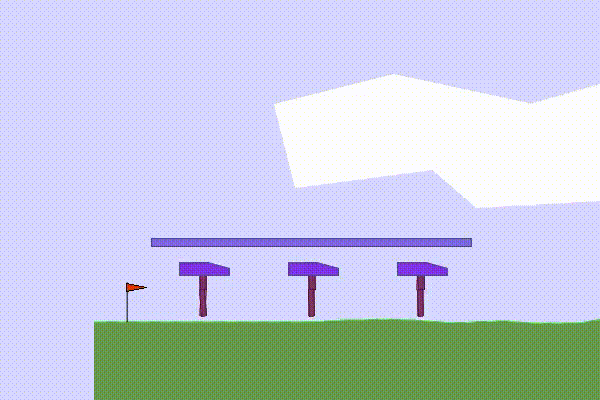
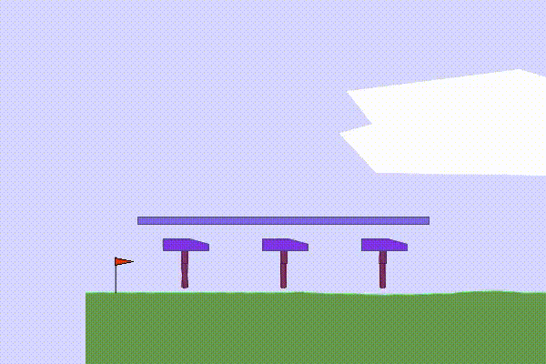
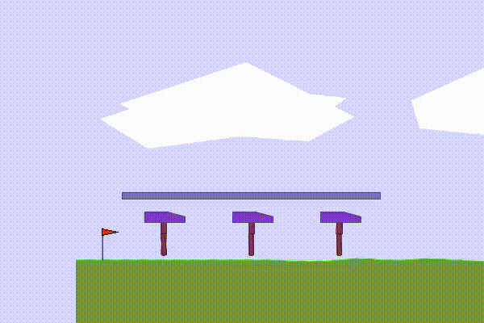

# Cooperative MultiWalker MARL

This project explores **cooperative multi-agent reinforcement learning** in the PettingZoo **MultiWalker** environment, where three walkers must coordinate to carry a shared package. The goal was to compare PPO, DDPG, and SAC, and to test whether hyperparameter optimization with Optuna improves learning stability and cooperation.

The results show that standard PPO and DDPG had high variance and frequent coordination failures, while SAC was more stable but achieved limited performance. The best result was achieved by **Optuna-optimized PPO**, showing that hyperparameter tuning is very important in cooperative MARL.

## Results

| Algorithm | Mean Episode Reward | Standard Deviation |
|---|---:|---:|
| PPO | 4.98 | ±50.20 |
| DDPG | -18.76 | ±52.11 |
| SAC | -4.18 | ±23.40 |
| PPO (Optuna) | 41.21 | ±6.63 |

## Trained Agents

<table>
  <tr>
    <td align="center">
      <strong>PPO</strong> 
      
    </td>
    <td align="center">
      <strong>DDPG</strong> 
      
    </td>
  </tr>
  <tr>
    <td align="center">
      <strong>SAC</strong> 
      
    </td>
    <td align="center">
      <strong>Optuna-Optimized PPO</strong> 
      
    </td>
  </tr>
</table>
